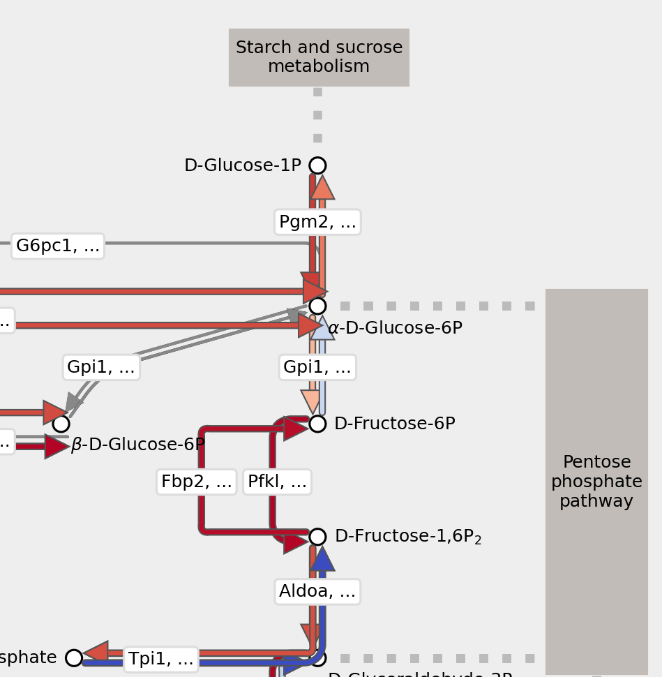

# Metaboglobe documentation

Welcome to the Metaboglobe documentation! **Metaboglobe** is a Python package to visualize the KEGG metabolic pathway maps with your data. It can be used to visualize metabolic fluxes, enzyme transcript levels, metabolites, or any other values that can be mapped to the KEGG pathway maps. Built on Matplotlib, it is designed to be flexible and easy to use, and it can be used in a Jupyter notebook or in a Python script.



## Why Metaboglobe?
Strangely enough, there are only a handful of software packages to visualize metabolic pathways [Metabolic Atlas, Pathview]. They may have limitations in the output formats (only low-res PNGs for example), or require uploading your data to a web server. Metaboglobe is designed to work offline, give you the flexibility to customize the plots, and the output can be in any format that Matplotlib supports (PNG, PDF, SVG, etc.).

In addition, Metaboglobe also has built-in support for visualizing Compass results on KEGG pathway maps. Compass is a software package to predict metabolic fluxes from single-cell RNA-seq data [Wagner et al.]. With Metaboglobe, you can easily visualize these predicted fluxes on the KEGG pathway maps, which can help you interpret the results and generate hypotheses about metabolic changes in your single-cell transcriptomic data.

## Installation
Installation using is straightforward. The only caveat is that the package is not yet available on PyPI, so you need to install it directly from GitHub.


[⮩ **Installation**](installation.md)

## Usage

The package can be used in a Jupyter notebook or in a Python script. The basic workflow is to load a KEGG pathway map, set the scores for reactions and compounds, and then plot the map.

[⮩ **User guide**](user_guide.md)


```{eval-rst}
.. Hidden TOCs

.. toctree::
   :maxdepth: 3
   :hidden:
   :includehidden:

   installation
   user_guide
   credits

```
